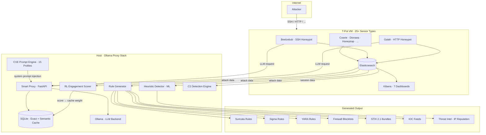

# LLM Honeypot Intelligence

[](LICENSE)
[](https://www.python.org/downloads/)
[](#requirements)
[](#auto-synced-threat-intelligence)

**Distributed honeypot intelligence platform** that combines LLM-powered adaptive honeypots with reinforcement learning, automated SIEM rule generation, ML-based anomaly detection, and behavioral C2/covert channel detection -- processing **55M+ attack events** from **22,000+ unique attacker IPs** across **122 countries**.

> **Target audience:** SOC analysts, threat intelligence teams, CERT/CSIRT operators, and security researchers.
> Built on [T-Pot](https://github.com/telekom-security/tpotce) with custom extensions for LLM-driven deception and automated detection engineering.

---

## Table of contents

- [What this does](#what-this-does)
- [Architecture](#architecture)
- [Components](#components)
- [Live metrics](#live-metrics)
- [Auto-synced threat intelligence](#auto-synced-threat-intelligence)
- [MITRE ATT\&CK mapping](#mitre-attck-mapping)
- [Generated rules](#generated-rules)
- [CVE honeypot profiles](#cve-honeypot-profiles)
- [Deploy your own](#deploy-your-own)
- [Repository structure](#repository-structure)
- [Requirements](#requirements)
- [Documentation](#documentation)
- [Contributing](#contributing)
- [License](#license)

---

## What this does

Traditional honeypots serve static responses. Attackers probe, get a canned reply, and move on. This platform changes the equation:

1. **LLM-powered deception.** Honeypots ([Beelzebub](https://github.com/mariocandela/beelzebub) for SSH, [Galah](https://github.com/0x4D31/galah) for HTTP) route through a smart proxy backed by Ollama. Attackers interact with an LLM that role-plays as the target system -- a vulnerable Apache server, a misconfigured Redis instance, or a Docker daemon with exposed API.

2. **Reinforcement learning.** An RL engagement scorer continuously evaluates which LLM responses keep attackers engaged longest, feeding back into cache selection. The proxy learns which deception strategies work.

3. **Automated detection engineering.** Every 6 hours, the platform analyzes accumulated attack traffic and generates production-ready Suricata, Sigma, YARA, and firewall rules -- no manual signature writing required.

4. **ML anomaly detection.** An Isolation Forest + DBSCAN pipeline identifies behavioral outliers, clusters attack campaigns, and builds IP reputation scores.

5. **C2 & covert channel detection.** A dedicated engine detects DNS tunneling, HTTP beaconing, and protocol anomalies in real time.

---

## Architecture



---

## Components

| Component | Module | Lines | Description |
|-----------|--------|------:|-------------|
| **Smart Proxy** | `proxy/src/main.py` | 527 | FastAPI caching proxy with exact + semantic cache lookup, exploration rate for RL |
| **Semantic Cache** | `proxy/src/cache.py` | 270 | SQLite-backed cache with cosine similarity via `nomic-embed-text` embeddings |
| **RL Scorer** | `proxy/src/rl_scorer.py` | 781 | Reinforcement learning engine that scores LLM responses by attacker engagement duration |
| **Rule Generator** | `proxy/src/rule_generator.py` | 1,566 | Automated generation of Suricata, Sigma, YARA rules + STIX 2.1 bundles from ES data |
| **ML Detector** | `proxy/src/heuristic_detector.py` | 775 | Isolation Forest anomaly detection, DBSCAN campaign clustering, IP reputation scoring |
| **C2 Detector** | `proxy/src/c2_detection/engine.py` | 773 | Behavioral C2 detection: DNS tunneling, HTTP beaconing, protocol anomalies |
| **CVE Engine** | `proxy/src/cve_engine.py` | 274 | Injects CVE-specific system prompts so the LLM role-plays as a vulnerable service |
| **CVE Templates** | `proxy/src/cve_templates.py` | 613 | 15 CVE profiles (Log4Shell, Spring4Shell, ProxyShell, MOVEit, and more) |

**Total custom code:** ~5,800 lines of Python across 12 modules.

---

## Live metrics

> Numbers from the production deployment. Updated periodically via auto-sync.

| Metric | Value |
|--------|------:|
| Total attack events processed | 55,000,000+ |
| Unique attacker IPs observed | 22,000+ |
| Countries of origin | 122 |
| Sensor servers (distributed) | 4 |
| Sensor types per server | 25+ |
| Handcrafted C2 Suricata rules | 23 |
| CVE honeypot profiles | 15 |
| Kibana dashboards | 7 |

---

## Auto-synced threat intelligence

The `rules/` and `threat-intel/` directories are **automatically updated every 6 hours** from the live honeypot infrastructure. A cron job on the host reads Docker volume outputs, sanitizes internal infrastructure details, and pushes to this repository.

### Consume the feeds

**Suricata rules** -- drop into your `/etc/suricata/rules/` directory:

```bash
curl -sL https://raw.githubusercontent.com/Leviticus-Triage/llm-honeypot-intelligence/main/rules/suricata/honeypot-generated.rules \
  -o /etc/suricata/rules/honeypot-generated.rules
suricatasc -c reload-rules
```

**IP blocklist** -- for firewalls, fail2ban, or SOAR playbooks:

```bash
curl -sL https://raw.githubusercontent.com/Leviticus-Triage/llm-honeypot-intelligence/main/rules/firewall/blocklist-plain.txt
```

**STIX 2.1 bundle** -- for MISP, OpenCTI, or any TIP:

```bash
curl -sL https://raw.githubusercontent.com/Leviticus-Triage/llm-honeypot-intelligence/main/rules/stix/bundle.json
```

---

## MITRE ATT&CK mapping

The platform observes and generates detections for the following techniques:

| Technique ID | Technique | Detection source | Output |
|-------------|-----------|-----------------|--------|
| [T1190](https://attack.mitre.org/techniques/T1190/) | Exploit Public-Facing Application | CVE honeypot profiles (Log4Shell, ProxyShell, MOVEit, ...) | Suricata + YARA |
| [T1110](https://attack.mitre.org/techniques/T1110/) | Brute Force | SSH/Telnet credential stuffing via Cowrie/Beelzebub | Sigma + IP blocklist |
| [T1059](https://attack.mitre.org/techniques/T1059/) | Command and Scripting Interpreter | Post-exploitation commands in SSH sessions | Sigma + YARA |
| [T1071](https://attack.mitre.org/techniques/T1071/) | Application Layer Protocol | HTTP/DNS C2 beaconing patterns | Suricata + C2 engine |
| [T1071.004](https://attack.mitre.org/techniques/T1071/004/) | DNS Tunneling | High-entropy DNS queries, abnormal query volume | C2 engine + Suricata |
| [T1041](https://attack.mitre.org/techniques/T1041/) | Exfiltration Over C2 Channel | Large outbound data patterns in honeypot sessions | ML detector |
| [T1595](https://attack.mitre.org/techniques/T1595/) | Active Scanning | Port scanning, service enumeration across sensors | Suricata + IP reputation |
| [T1592](https://attack.mitre.org/techniques/T1592/) | Gather Victim Host Information | OS fingerprinting, service probing via HTTP honeypot | Sigma |
| [T1105](https://attack.mitre.org/techniques/T1105/) | Ingress Tool Transfer | Malware download attempts (wget, curl, tftp) | YARA + Suricata |
| [T1571](https://attack.mitre.org/techniques/T1571/) | Non-Standard Port | C2 over unusual ports detected by behavioral analysis | C2 engine |
| [T1036](https://attack.mitre.org/techniques/T1036/) | Masquerading | Fake service banners, protocol impersonation | ML detector |
| [T1078](https://attack.mitre.org/techniques/T1078/) | Valid Accounts | Credential reuse across multiple honeypot sensors | Sigma + campaign clustering |

---

## Generated rules

The rule generator analyzes Elasticsearch data and produces rules in multiple formats:

| Format | Directory | Use case |
|--------|-----------|----------|
| **Suricata** | `rules/suricata/` | Network IDS/IPS inline detection |
| **Sigma** | `rules/sigma/` | SIEM-agnostic log detection (convertible to Splunk, ELK, QRadar) |
| **YARA** | `rules/yara/` | File and memory scanning for malware artifacts |
| **Firewall blocklists** | `rules/firewall/` | iptables, nftables, and plain-text IP lists |
| **STIX 2.1** | `rules/stix/` | Structured threat intel for MISP, OpenCTI, TAXII feeds |
| **IOC lists** | `rules/iocs/` | Machine-readable indicators of compromise |

Additionally, `rules/suricata/c2-detection.rules` contains **23 handcrafted Suricata rules** for C2 protocol detection (DNS tunneling, HTTP beaconing, encoded payloads, protocol anomalies).

---

## CVE honeypot profiles

The CVE engine injects vulnerability-specific system prompts into the LLM, making honeypots respond as if they are running unpatched software. This attracts targeted exploitation attempts and captures attacker TTPs for specific CVEs:

| CVE | Target | Attack vector |
|-----|--------|--------------|
| CVE-2021-44228 | Apache Log4j (Log4Shell) | JNDI injection via HTTP headers |
| CVE-2022-22965 | Spring Framework (Spring4Shell) | Class loader manipulation |
| CVE-2021-34473 | Microsoft Exchange (ProxyShell) | SSRF + privilege escalation |
| CVE-2023-34362 | MOVEit Transfer | SQL injection → RCE |
| CVE-2023-46604 | Apache ActiveMQ | Deserialization RCE |
| CVE-2024-1709 | ConnectWise ScreenConnect | Auth bypass |
| CVE-2023-22527 | Atlassian Confluence | Template injection RCE |
| CVE-2021-26855 | Exchange (ProxyLogon) | SSRF pre-auth |
| CVE-2023-0669 | GoAnywhere MFT | Deserialization RCE |
| CVE-2021-27065 | Exchange (ProxyLogon chain) | Arbitrary file write |
| CVE-2023-20198 | Cisco IOS XE | Web UI privilege escalation |
| CVE-2024-3400 | Palo Alto PAN-OS | Command injection |
| CVE-2023-42793 | JetBrains TeamCity | Auth bypass RCE |
| CVE-2022-1388 | F5 BIG-IP | iControl REST auth bypass |
| CVE-2021-21972 | VMware vCenter | RCE via vSphere Client |

---

## Deploy your own

### Prerequisites

- [T-Pot](https://github.com/telekom-security/tpotce) deployed (VM or bare metal)
- [Ollama](https://ollama.ai) running on the host with a model pulled (e.g., `llama3`)
- Docker + Docker Compose on the host
- Python 3.10+

### Quick start

```bash
# Clone this repository
git clone https://github.com/Leviticus-Triage/llm-honeypot-intelligence.git
cd llm-honeypot-intelligence/proxy

# Configure credentials
cp .env.example .env
# Edit .env with your Elasticsearch URL, credentials, and T-Pot VM IP

cp config.yaml.example config.yaml
# Adjust proxy settings if needed

# Launch the full stack
docker compose up -d

# Verify
docker compose ps
curl -s http://localhost:11435/proxy/health | python3 -m json.tool
```

The proxy stack runs 5 containers:
- **ollama-proxy** -- caching proxy on port 11435
- **ollama-rl-scorer** -- RL scorer (every 5 min)
- **ollama-rule-generator** -- rule generation (every 6 hours)
- **ollama-heuristic-detector** -- ML analysis (every 30 min)
- **ollama-c2-detector** -- C2 detection (every 5 min)

Point your honeypots (Beelzebub, Galah) to `<host-ip>:11435` instead of the raw Ollama port.

See [docs/setup-guide.md](docs/setup-guide.md) for the full deployment walkthrough.

---

## Repository structure

```
llm-honeypot-intelligence/
├── README.md
├── LICENSE                         # MIT
├── SECURITY.md                     # Vulnerability reporting
├── CONTRIBUTING.md                 # Contribution guidelines
├── CITATION.cff                    # Academic citation metadata
├── .gitignore
├── .github/workflows/
│   └── lint.yml                    # CI: ruff linting
├── docs/
│   ├── architecture.md             # Design rationale and data flow
│   ├── results.md                  # Operational results and analysis
│   ├── setup-guide.md              # Full deployment walkthrough
│   └── mitre-attack-mapping.md     # Detailed ATT&CK coverage
├── proxy/                          # Ollama Smart Proxy (custom code)
│   ├── src/
│   │   ├── main.py                 # FastAPI proxy with caching + exploration
│   │   ├── cache.py                # Exact + semantic cache (SQLite + embeddings)
│   │   ├── embeddings.py           # nomic-embed-text integration
│   │   ├── models.py               # Pydantic data models
│   │   ├── rl_scorer.py            # Reinforcement learning engagement scorer
│   │   ├── rule_generator.py       # Automated SIEM rule generation
│   │   ├── heuristic_detector.py   # ML anomaly detection (Isolation Forest + DBSCAN)
│   │   ├── c2_detection/           # C2 & covert channel detection engine
│   │   ├── cve_engine.py           # CVE-specific prompt injection
│   │   └── cve_templates.py        # 15 CVE vulnerability profiles
│   ├── run_scorer.py               # RL scorer entry point
│   ├── run_rule_generator.py       # Rule generator entry point
│   ├── run_heuristic_detector.py   # ML detector entry point
│   ├── run_c2_detector.py          # C2 detector entry point
│   ├── config.yaml.example         # Proxy configuration template
│   ├── .env.example                # Credential template
│   ├── docker-compose.yml          # Full 5-container stack
│   ├── Dockerfile
│   └── requirements.txt
├── rules/                          # ⚡ AUTO-SYNCED every 6 hours
│   ├── suricata/
│   │   ├── honeypot-generated.rules    # Auto-generated from attack data
│   │   └── c2-detection.rules         # 23 handcrafted C2 detection rules
│   ├── sigma/                      # SIEM-agnostic detection rules
│   ├── yara/                       # File/memory scanning rules
│   ├── firewall/                   # iptables, nftables, plain-text blocklists
│   ├── stix/                       # STIX 2.1 bundles
│   └── iocs/                       # Machine-readable IOC lists
├── threat-intel/                   # ⚡ AUTO-SYNCED every 6 hours
│   ├── ip-reputation.json          # Scored IP reputation database
│   ├── campaigns.json              # Clustered attack campaigns
│   ├── dynamic-blocklist.txt       # Active threat IPs
│   └── alerts.json                 # High-confidence threat alerts
├── dashboards/                     # Kibana dashboard exports
│   ├── llm-honeypot-intelligence.ndjson
│   ├── c2-dashboard.ndjson
│   ├── cve-dashboard.ndjson
│   └── setup-attack-class.sh       # Dashboard import helper
└── scripts/
    └── sync-to-github.sh           # Auto-sync cron script
```

---

## Requirements

- **Linux** host for the proxy stack (Docker)
- **Python 3.10+**
- **Ollama** with a pulled model (e.g., `ollama pull llama3`)
- **T-Pot** honeypot VM with Elasticsearch accessible
- **Docker + Docker Compose** v2

---

## Documentation

| Document | Description |
|----------|-------------|
| [docs/architecture.md](docs/architecture.md) | System design, data flow, component interaction |
| [docs/results.md](docs/results.md) | Operational results, attack statistics, campaign analysis |
| [docs/setup-guide.md](docs/setup-guide.md) | Full deployment guide with prerequisites and troubleshooting |
| [docs/mitre-attack-mapping.md](docs/mitre-attack-mapping.md) | Detailed MITRE ATT&CK technique coverage |
| [SECURITY.md](SECURITY.md) | Vulnerability reporting |
| [CONTRIBUTING.md](CONTRIBUTING.md) | How to contribute |
| [CITATION.cff](CITATION.cff) | Citation metadata for academic use |

---

## Related projects

- **[ir-sinkhole](https://github.com/Leviticus-Triage/ir-sinkhole)** -- Host-based incident response sinkhole for C2 containment during forensics. Developed from a real Lazarus Group incident response case.

---

## Contributing

See [CONTRIBUTING.md](CONTRIBUTING.md) and [SECURITY.md](SECURITY.md).

---

## License

MIT. See [LICENSE](LICENSE).
