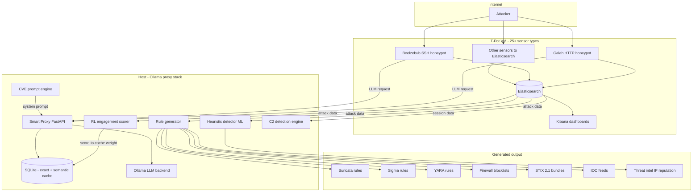

# LLM Honeypot Intelligence

[](LICENSE)
[](https://www.python.org/downloads/)
[](#requirements)
[](#auto-synced-threat-intelligence)
[](https://exodus-hensen.site/kiosk/)

**Distributed honeypot intelligence platform** that combines LLM-powered adaptive honeypots with reinforcement learning, automated SIEM rule generation, ML-based anomaly detection, and behavioral C2/covert channel detection -- processing **55M+ attack events** from **22,000+ unique attacker IPs** across **122 countries**.

> **Target audience:** SOC analysts, threat intelligence teams, CERT/CSIRT operators, and security researchers.
> Built on [T-Pot](https://github.com/telekom-security/tpotce) with custom extensions for LLM-driven deception and automated detection engineering.

**See it live:** [**exodus-hensen.site/kiosk/**](https://exodus-hensen.site/kiosk/) — read-only attack map + LLM / CVE / C2 dashboards (refreshed ~every minute, no internal infrastructure exposed). [Embed on your site](docs/LIVE-KIOSK.md#embed-on-your-site) · [Full kiosk docs](docs/LIVE-KIOSK.md)

---

## Table of contents

- [What this does](#what-this-does)
- [Architecture](#architecture)
- [Components](#components)
- [Live metrics](#live-metrics)
- [Live threat kiosk](#live-threat-kiosk)
- [Auto-synced threat intelligence](#auto-synced-threat-intelligence)
- [MITRE ATT\&CK mapping](#mitre-attck-mapping)
- [Generated rules](#generated-rules)
- [CVE honeypot profiles](#cve-honeypot-profiles)
- [Deploy your own](#deploy-your-own)
- [Repository structure](#repository-structure)
- [Requirements](#requirements)
- [Documentation](#documentation)
- [Contributing](#contributing)
- [Access and formal review](#access-and-formal-review)
- [License](#license)

---

## What this does

Traditional honeypots serve static responses. Attackers probe, get a canned reply, and move on. This platform changes the equation:

1. **LLM-powered deception.** Honeypots ([Beelzebub](https://github.com/mariocandela/beelzebub) for SSH, [Galah](https://github.com/0x4D31/galah) for HTTP) route through a smart proxy backed by Ollama. Attackers interact with an LLM that role-plays as the target system -- a vulnerable Apache server, a misconfigured Redis instance, or a Docker daemon with exposed API.

2. **Reinforcement learning.** An RL engagement scorer continuously evaluates which LLM responses keep attackers engaged longest, feeding back into cache selection. The proxy learns which deception strategies work.

3. **Automated detection engineering.** Every 6 hours, the platform analyzes accumulated attack traffic and generates production-ready Suricata, Sigma, YARA, and firewall rules -- no manual signature writing required.

4. **ML anomaly detection.** An Isolation Forest + DBSCAN pipeline identifies behavioral outliers, clusters attack campaigns, and builds IP reputation scores.

5. **C2 & covert channel detection.** A dedicated engine detects DNS tunneling, HTTP beaconing, and protocol anomalies in real time.

---

## Architecture


```mermaid
flowchart TB
    subgraph Internet["Internet"]
        ATK[Attacker]
    end

    subgraph TPOT["T-Pot VM - 25+ sensor types"]
        BEE[Beelzebub SSH honeypot]
        GAL[Galah HTTP honeypot]
        OTHER[Other sensors to Elasticsearch]
        ES[(Elasticsearch)]
        KIB[Kibana dashboards]
    end

    subgraph HOST["Host - Ollama proxy stack"]
        PROXY[Smart Proxy FastAPI]
        CACHE[(SQLite - exact + semantic cache)]
        OLLAMA[Ollama LLM backend]
        RL[RL engagement scorer]
        RULES[Rule generator]
        ML[Heuristic detector ML]
        C2[C2 detection engine]
        CVE[CVE prompt engine]
    end

    subgraph OUTPUT["Generated output"]
        SUR[Suricata rules]
        SIG[Sigma rules]
        YAR[YARA rules]
        FW[Firewall blocklists]
        STIX[STIX 2.1 bundles]
        IOC[IOC feeds]
        THREAT[Threat intel IP reputation]
    end

    ATK --> BEE
    ATK --> GAL
    ATK --> OTHER
    BEE -->|LLM request| PROXY
    GAL -->|LLM request| PROXY
    PROXY --> CACHE
    PROXY --> OLLAMA
    CVE -->|system prompt| PROXY
    RL -->|score to cache weight| CACHE
    ES -->|attack data| RL
    ES -->|attack data| RULES
    ES -->|attack data| ML
    ES -->|session data| C2
    OTHER --> ES
    BEE --> ES
    GAL --> ES
    ES --> KIB
    RULES --> SUR
    RULES --> SIG
    RULES --> YAR
    RULES --> FW
    RULES --> STIX
    RULES --> IOC
    ML --> THREAT
```

---

## Components

| Component | Module | Lines | Description |
|-----------|--------|------:|-------------|
| **Smart Proxy** | `proxy/src/main.py` | 527 | FastAPI caching proxy with exact + semantic cache lookup, exploration rate for RL |
| **Semantic Cache** | `proxy/src/cache.py` | 270 | SQLite-backed cache with cosine similarity via `nomic-embed-text` embeddings |
| **RL Scorer** | `proxy/src/rl_scorer.py` | 781 | Reinforcement learning engine that scores LLM responses by attacker engagement duration |
| **Rule Generator** | `proxy/src/rule_generator.py` | 1,566 | Automated generation of Suricata, Sigma, YARA rules + STIX 2.1 bundles from ES data |
| **ML Detector** | `proxy/src/heuristic_detector.py` | 775 | Isolation Forest anomaly detection, DBSCAN campaign clustering, IP reputation scoring |
| **C2 Detector** | `proxy/src/c2_detection/engine.py` | 773 | Behavioral C2 detection: DNS tunneling, HTTP beaconing, protocol anomalies |
| **CVE Engine** | `proxy/src/cve_engine.py` | 274 | Injects CVE-specific system prompts so the LLM role-plays as a vulnerable service |
| **CVE Templates** | `proxy/src/cve_templates.py` | 1,370+ | 34 CVE profiles (2023-2026) covering Fortinet, PAN-OS, Ivanti, Cisco, PHP, SAP, VMware, and more |

**Total custom code:** ~5,800 lines of Python across 12 modules.

### Operational highlights

- **Cache hit rate: 85.2%** -- exact + semantic caching saves ~2,000 hours of GPU time (~7x effective speedup)
- **RL optimization:** 88,176 responses scored, average engagement score 0.488, 82 distinct score values showing real behavioral differentiation
- **C2 detection:** 48,609 indicators detected, 182 critical threats, 1,769 beaconing detections, 7 MITRE techniques
- **ML pipeline:** 16 anomalies detected via Isolation Forest, 4 attack campaigns clustered via DBSCAN, 17 predictive alerts generated
- **Peak day:** 19.8M events in a single day (February 14, 2026)

---

## Live metrics

> Numbers from the production deployment. Updated periodically via auto-sync.

| Metric | Value |
|--------|------:|
| Total attack events processed | 55,500,000+ |
| Unique attacker IPs observed | 22,281 |
| Countries of origin | 122 |
| Sensor servers (distributed) | 4 |
| Sensor types per server | 25+ |
| Generated Sigma rules | 10 (5 SSH + 5 HTTP) |
| Generated YARA rules | 7 |
| Generated Suricata rules | 48 + 23 handcrafted C2 |
| Firewall-blocked IPs (peak) | 503 |
| IOCs extracted | 261 |
| STIX 2.1 objects | 60 |
| C2 indicators detected | 48,609 |
| CVE honeypot sessions | 516,000+ |
| RL-scored responses | 88,176 |
| Cached prompts | 11,048 |
| Cache hit rate | 85.2% |
| GPU time saved | ~2,000 hours |
| ML anomalies detected | 16 |
| Attack campaigns identified | 4 |
| Predictive alerts generated | 17 |
| Beaconing detections | 1,769 |
| CVE honeypot profiles | 34 |
| Kibana dashboards | 7 |

**Latest generated snapshot** (see `rules/latest_summary.json` for timestamp and counts): 6 Sigma, 5 YARA, 30 Suricata rules in the generated set, 514 firewall IPs, 63 STIX objects, 218 IOCs (as of the last rule-generator run).

---

## Live threat kiosk

Public, read-only view of the running deployment — no Kibana login, no honeypot access, no stack fingerprinting.

| | |
|---|---|
| **Open** | [**https://exodus-hensen.site/kiosk/**](https://exodus-hensen.site/kiosk/) |
| **Panels** | Global attack map · LLM honeypot intelligence · CVE sessions · C2 / covert channels |
| **Refresh** | Screenshots + attack counters every few seconds |
| **Docs** | [docs/LIVE-KIOSK.md](docs/LIVE-KIOSK.md) · embed snippet: [docs/embed/kiosk-embed.html](docs/embed/kiosk-embed.html) |

The kiosk captures the same Kibana dashboards exported under [`dashboards/`](dashboards/) (e.g. `llm-honeypot-intelligence.ndjson`, `cve-dashboard.ndjson`, `c2-dashboard.ndjson`), sanitizes labels and metadata, and publishes static PNGs to the public edge.

```html
<!-- Minimal embed — see docs/LIVE-KIOSK.md for CSP notes -->
<iframe
  src="https://exodus-hensen.site/kiosk/"
  title="Live Threat Intelligence"
  width="100%" height="920"
  style="border:0;border-radius:12px;background:#07090d;"
  loading="lazy" referrerpolicy="no-referrer" sandbox="allow-scripts"
></iframe>
```

---

## Auto-synced threat intelligence

The `rules/` and `threat-intel/` directories are **automatically updated every 6 hours** from the live honeypot infrastructure. A scheduled job on the host (a persistent **systemd user timer** with downtime catch-up — see [`deploy/systemd/`](deploy/systemd/)) reads Docker volume outputs, sanitizes internal infrastructure details, and pushes to this repository.

**Rules layout**

| Path | Purpose |
|------|---------|
| `rules/latest/` | Current snapshot (same layout as the generator output) |
| `rules/archive/<YYYYMMDD_HHMM>/` | Append-only per-run copies for history and diffing |
| `rules/` (root) | Mirror of the latest snapshot for stable URLs and direct `curl` |
| `rules/suricata/c2-detection.rules` | Handcrafted C2 rules (not overwritten by the generator) |
| `rules/*-peak-run*` | Historical peak-run exports retained for reference |

### Consume the feeds

**Suricata rules** -- generated set is `honeypot.rules` (root mirror and `latest/suricata/`). Legacy filename `honeypot-generated.rules` may still exist from older syncs; prefer `honeypot.rules` for the current run.

```bash
curl -sL https://raw.githubusercontent.com/Leviticus-Triage/llm-honeypot-intelligence/main/rules/suricata/honeypot.rules \
  -o /etc/suricata/rules/honeypot.rules
# Optional: handcrafted C2 rules (add alongside generated)
curl -sL https://raw.githubusercontent.com/Leviticus-Triage/llm-honeypot-intelligence/main/rules/suricata/c2-detection.rules \
  -o /etc/suricata/rules/c2-detection.rules
suricatasc -c reload-rules
```

**IP blocklist** -- for firewalls, fail2ban, or SOAR playbooks:

```bash
curl -sL https://raw.githubusercontent.com/Leviticus-Triage/llm-honeypot-intelligence/main/rules/firewall/blocklist_plain_blocklist.txt
```

**STIX 2.1 bundle** -- for MISP, OpenCTI, or any TIP:

```bash
curl -sL https://raw.githubusercontent.com/Leviticus-Triage/llm-honeypot-intelligence/main/rules/stix/bundle.json
```

---

## MITRE ATT&CK mapping

The platform observes and generates detections for the following techniques:

| Technique ID | Technique | Detection source | Output |
|-------------|-----------|-----------------|--------|
| [T1190](https://attack.mitre.org/techniques/T1190/) | Exploit Public-Facing Application | 34 CVE honeypot profiles (FortiOS, PAN-OS, Ivanti, PHP-CGI, SAP, VMware, ...) | Suricata + YARA |
| [T1110](https://attack.mitre.org/techniques/T1110/) | Brute Force | SSH/Telnet credential stuffing via Cowrie/Beelzebub | Sigma + IP blocklist |
| [T1059](https://attack.mitre.org/techniques/T1059/) | Command and Scripting Interpreter | Post-exploitation commands in SSH sessions | Sigma + YARA |
| [T1071](https://attack.mitre.org/techniques/T1071/) | Application Layer Protocol | HTTP/DNS C2 beaconing patterns | Suricata + C2 engine |
| [T1071.004](https://attack.mitre.org/techniques/T1071/004/) | DNS Tunneling | High-entropy DNS queries, abnormal query volume | C2 engine + Suricata |
| [T1041](https://attack.mitre.org/techniques/T1041/) | Exfiltration Over C2 Channel | Large outbound data patterns in honeypot sessions | ML detector |
| [T1595](https://attack.mitre.org/techniques/T1595/) | Active Scanning | Port scanning, service enumeration across sensors | Suricata + IP reputation |
| [T1592](https://attack.mitre.org/techniques/T1592/) | Gather Victim Host Information | OS fingerprinting, service probing via HTTP honeypot | Sigma |
| [T1105](https://attack.mitre.org/techniques/T1105/) | Ingress Tool Transfer | Malware download attempts (wget, curl, tftp) | YARA + Suricata |
| [T1571](https://attack.mitre.org/techniques/T1571/) | Non-Standard Port | C2 over unusual ports detected by behavioral analysis | C2 engine |
| [T1036](https://attack.mitre.org/techniques/T1036/) | Masquerading | Fake service banners, protocol impersonation | ML detector |
| [T1078](https://attack.mitre.org/techniques/T1078/) | Valid Accounts | Credential reuse across multiple honeypot sensors | Sigma + campaign clustering |

---

## Generated rules

The rule generator analyzes Elasticsearch data and produces rules in multiple formats:

| Format | Directory | Use case |
|--------|-----------|----------|
| **Suricata** | `rules/suricata/` | Network IDS/IPS inline detection |
| **Sigma** | `rules/sigma/` | SIEM-agnostic log detection (convertible to Splunk, ELK, QRadar) |
| **YARA** | `rules/yara/` | File and memory scanning for malware artifacts |
| **Firewall blocklists** | `rules/firewall/` | iptables, nftables, and plain-text IP lists |
| **STIX 2.1** | `rules/stix/` | Structured threat intel for MISP, OpenCTI, TAXII feeds |
| **IOC lists** | `rules/iocs/` | Machine-readable indicators of compromise |

Additionally, `rules/suricata/c2-detection.rules` contains **23 handcrafted Suricata rules** for C2 protocol detection (DNS tunneling, HTTP beaconing, encoded payloads, protocol anomalies).

**Cumulative output (historical peak):** 10 Sigma rules, 7 YARA rules, 48 Suricata rules, 503 firewall-blocked IPs, 261 IOCs, and 60 STIX 2.1 objects. **Current counts** per run are in `rules/latest_summary.json` (and duplicated under `rules/latest/`). Rules are regenerated every 6 hours from the latest 24-hour attack window; each run is also stored under `rules/archive/`.

---

## CVE honeypot profiles

The CVE engine injects vulnerability-specific system prompts into the LLM, making honeypots respond as if they are running unpatched software. This attracts targeted exploitation attempts and captures attacker TTPs for specific CVEs. All 34 profiles are based on real-world PoC data and CISA KEV-listed vulnerabilities, spanning 2023-2026.

### SSH / CLI profiles (13)

| CVE | CVSS | Target | Attack vector |
|-----|------|--------|--------------|
| CVE-2024-55591 | 9.8 | Fortinet FortiOS | Auth bypass via Node.js websocket |
| CVE-2024-47575 | 9.8 | Fortinet FortiManager (FortiJump) | Missing auth for FGFM protocol |
| CVE-2025-0282 | 9.0 | Ivanti Connect Secure | Stack buffer overflow (unauthenticated RCE) |
| CVE-2024-21887 | 9.1 | Ivanti Connect Secure | Command injection in web components |
| CVE-2024-3400 | 10.0 | Palo Alto PAN-OS GlobalProtect | OS command injection (zero-day) |
| CVE-2024-20353 | 8.6 | Cisco ASA/FTD (ArcaneDoor) | Denial of service + persistent backdoor |
| CVE-2024-6387 | 8.1 | OpenSSH (regreSSHion) | Signal handler race condition RCE |
| CVE-2024-21762 | 9.6 | FortiOS SSL VPN | OOB write allowing unauthenticated RCE |
| CVE-2025-22457 | 9.0 | Ivanti Connect Secure | Stack overflow via HTTP headers (UNC5221) |
| CVE-2025-24472 | 9.8 | FortiOS/FortiProxy | Auth bypass via crafted CSF proxy requests |
| CVE-2024-3094 | 10.0 | XZ Utils/liblzma | Supply chain SSH backdoor |
| CVE-2024-47176 | 9.8 | CUPS cups-browsed | RCE chain via malicious IPP printer |
| CVE-2026-24858 | 9.8 | Fortinet FortiCloud SSO | Cross-account device takeover (CISA KEV Jan 2026) |

### HTTP / Web profiles (21)

| CVE | CVSS | Target | Attack vector |
|-----|------|--------|--------------|
| CVE-2023-46805 | 8.2 | Ivanti Connect Secure (Web) | Auth bypass in web component |
| CVE-2023-4966 | 9.4 | Citrix NetScaler (Citrix Bleed) | Session token leak via buffer overread |
| CVE-2024-1709 | 10.0 | ConnectWise ScreenConnect | Setup wizard auth bypass |
| CVE-2024-23897 | 9.8 | Jenkins CI/CD | Arbitrary file read via args4j CLI parser |
| CVE-2024-24919 | 8.6 | Check Point Security Gateway | Path traversal info disclosure |
| CVE-2026-1731 | 9.8 | BeyondTrust PRA/Remote Support | OS command injection |
| CVE-2025-40536 | 8.4 | SolarWinds Web Help Desk | Security control bypass |
| CVE-2024-43468 | 9.8 | Microsoft SCCM | SQL injection in management point |
| CVE-2024-4577 | 9.8 | PHP-CGI (Windows) | Argument injection RCE via Best-Fit mapping |
| CVE-2024-50623 | 10.0 | Cleo Harmony/VLTrader/LexiCom | Unrestricted file upload RCE (Cl0p) |
| CVE-2025-0108 | 9.1 | PAN-OS management web | Auth bypass via Nginx/Apache path confusion |
| CVE-2024-27198 | 9.8 | JetBrains TeamCity | Auth bypass via path traversal |
| CVE-2024-0012 | 9.3 | PAN-OS management interface | Auth bypass (chained with CVE-2024-9474) |
| CVE-2025-31324 | 10.0 | SAP NetWeaver AS Java | Unrestricted file upload for web shell |
| CVE-2024-55956 | 9.8 | Cleo VLTrader/LexiCom | Autorun directory RCE (Cl0p) |
| CVE-2024-28995 | 8.6 | SolarWinds Serv-U | Path traversal (unauthenticated file read) |
| CVE-2025-23006 | 9.8 | SonicWall SMA1000 | Deserialization RCE |
| CVE-2024-9474 | 7.2 | PAN-OS management web | OS command injection as root |
| CVE-2026-22719 | 8.1 | VMware Aria Operations | Command injection RCE (CISA KEV Mar 2026) |
| CVE-2026-28289 | 10.0 | FreeScout Help Desk (Mail2Shell) | Zero-click RCE via .htaccess TOCTOU bypass |
| CVE-2026-27971 | 9.8 | Qwik Framework | server$ deserialization RCE |

---

## Deploy your own

### Cloud (OTC) — current production path

Homelab Proxmox is **retired**. Use two OTC ECS instances:

1. **AI stack** — `Sec-Systems/ai-workstation-cloud/` on `ai-cloud` (see [docs/CLOUD-DEPLOYMENT.md](docs/CLOUD-DEPLOYMENT.md))
2. **T-Pot HIVE** — [deploy/tpot-cloud/](deploy/tpot-cloud/) on a second ECS ([tpotce](https://github.com/telekom-security/tpotce))

Project how-to: [KI-test-dev/docs/HOWTO-CLOUD-STACK.md](https://github.com/dgskjeuj/KI-test-dev/blob/main/docs/HOWTO-CLOUD-STACK.md)

### Prerequisites (generic / on-prem)

- [T-Pot](https://github.com/telekom-security/tpotce) deployed (VM or bare metal)
- [Ollama](https://ollama.ai) running on the host with a model pulled (e.g., `llama3`)
- Docker + Docker Compose on the host
- Python 3.10+

### Quick start

```bash
# Clone this repository
git clone https://github.com/Leviticus-Triage/llm-honeypot-intelligence.git
cd llm-honeypot-intelligence/proxy

# Configure credentials
cp .env.example .env
# Edit .env with your Elasticsearch URL, credentials, and T-Pot VM IP

cp config.yaml.example config.yaml
# Adjust proxy settings if needed

# Launch the full stack
docker compose up -d

# Verify
docker compose ps
curl -s http://localhost:11435/proxy/health | python3 -m json.tool
```

The proxy stack runs 5 containers:
- **ollama-proxy** -- caching proxy on port 11435
- **ollama-rl-scorer** -- RL scorer (every 5 min)
- **ollama-rule-generator** -- rule generation (every 6 hours)
- **ollama-heuristic-detector** -- ML analysis (every 30 min)
- **ollama-c2-detector** -- C2 detection (every 5 min)

Point your honeypots (Beelzebub, Galah) to `<host-ip>:11435` instead of the raw Ollama port.

See [docs/setup-guide.md](docs/setup-guide.md) for the full deployment walkthrough.

---

## Repository structure

```
llm-honeypot-intelligence/
├── README.md
├── LICENSE                         # MIT
├── SECURITY.md                     # Vulnerability reporting
├── CONTRIBUTING.md                 # Contribution guidelines
├── CITATION.cff                    # Academic citation metadata
├── .gitignore
├── .github/workflows/
│   └── lint.yml                    # CI: ruff linting
├── docs/
│   ├── architecture.md             # Design rationale and data flow
│   ├── LIVE-KIOSK.md               # Public live view + embed guide
│   ├── embed/kiosk-embed.html      # Copy-paste iframe for websites
│   ├── results.md                  # Operational results and analysis
│   ├── setup-guide.md              # Full deployment walkthrough
│   └── mitre-attack-mapping.md     # Detailed ATT&CK coverage
├── proxy/                          # Ollama Smart Proxy (custom code)
│   ├── src/
│   │   ├── main.py                 # FastAPI proxy with caching + exploration
│   │   ├── cache.py                # Exact + semantic cache (SQLite + embeddings)
│   │   ├── embeddings.py           # nomic-embed-text integration
│   │   ├── models.py               # Pydantic data models
│   │   ├── rl_scorer.py            # Reinforcement learning engagement scorer
│   │   ├── rule_generator.py       # Automated SIEM rule generation
│   │   ├── heuristic_detector.py   # ML anomaly detection (Isolation Forest + DBSCAN)
│   │   ├── c2_detection/           # C2 & covert channel detection engine
│   │   ├── cve_engine.py           # CVE-specific prompt injection
│   │   └── cve_templates.py        # 34 CVE vulnerability profiles (2023-2026, CISA KEV)
│   ├── run_scorer.py               # RL scorer entry point
│   ├── run_rule_generator.py       # Rule generator entry point
│   ├── run_heuristic_detector.py   # ML detector entry point
│   ├── run_c2_detector.py          # C2 detector entry point
│   ├── config.yaml.example         # Proxy configuration template
│   ├── .env.example                # Credential template
│   ├── docker-compose.yml          # Full 5-container stack
│   ├── Dockerfile
│   └── requirements.txt
├── rules/                          # ⚡ AUTO-SYNCED every 6 hours
│   ├── latest/                     # Current snapshot (sigma, yara, suricata, …)
│   ├── archive/                    # Per-run history: archive/<YYYYMMDD_HHMM>/…
│   ├── reports/                    # threat_intel_report.md (under latest/ too)
│   ├── latest_summary.json         # Counts + manifest for the latest run
│   ├── manifest.json
│   ├── suricata/
│   │   ├── honeypot.rules          # Auto-generated (current primary)
│   │   ├── honeypot-generated.rules # Legacy name (may exist from older syncs)
│   │   └── c2-detection.rules      # 23 handcrafted C2 detection rules
│   ├── sigma/                      # SIEM-agnostic detection rules (root mirror)
│   ├── yara/                       # File/memory scanning rules
│   ├── firewall/                   # iptables, nftables, plain-text blocklists
│   ├── stix/                       # STIX 2.1 bundles
│   └── iocs/                       # Machine-readable IOC lists
├── threat-intel/                   # ⚡ AUTO-SYNCED every 6 hours
│   ├── ip-reputation.json          # Scored IP reputation database
│   ├── campaigns.json              # Clustered attack campaigns
│   ├── dynamic-blocklist.txt       # Active threat IPs
│   └── alerts.json                 # High-confidence threat alerts
├── dashboards/                     # Kibana dashboard exports (also shown in live kiosk)
│   ├── llm-honeypot-intelligence.ndjson
│   ├── c2-dashboard.ndjson
│   ├── cve-dashboard.ndjson
│   └── setup-attack-class.sh       # Dashboard import helper
└── scripts/
    └── sync-to-github.sh           # Auto-sync cron script
```

---

## Requirements

- **Linux** host for the proxy stack (Docker)
- **Python 3.10+**
- **Ollama** with a pulled model (e.g., `ollama pull llama3`)
- **T-Pot** honeypot VM with Elasticsearch accessible
- **Docker + Docker Compose** v2

---

## Documentation

| Document | Description |
|----------|-------------|
| [docs/LIVE-KIOSK.md](docs/LIVE-KIOSK.md) | Public live view at [exodus-hensen.site/kiosk/](https://exodus-hensen.site/kiosk/), security model, embed |
| [docs/architecture.md](docs/architecture.md) | System design, data flow, component interaction |
| [docs/results.md](docs/results.md) | Operational results, attack statistics, campaign analysis |
| [docs/setup-guide.md](docs/setup-guide.md) | Full deployment guide with prerequisites and troubleshooting |
| [docs/CURSOR-CLOUD-AGENT-CVE-SYNC.md](docs/CURSOR-CLOUD-AGENT-CVE-SYNC.md) | Cursor Cloud Agent + trickest-cve MCP for automated `cve_templates.py` updates |
| [docs/mitre-attack-mapping.md](docs/mitre-attack-mapping.md) | Detailed MITRE ATT&CK technique coverage |
| [SECURITY.md](SECURITY.md) | Vulnerability reporting |
| [CONTRIBUTING.md](CONTRIBUTING.md) | How to contribute |
| [CITATION.cff](CITATION.cff) | Citation metadata for academic use |

---

## Related projects

- **[ir-sinkhole](https://github.com/Leviticus-Triage/ir-sinkhole)** -- Host-based incident response sinkhole for C2 containment during forensics. Developed from a real Lazarus Group incident response case.

---

## Contributing

See [CONTRIBUTING.md](CONTRIBUTING.md) and [SECURITY.md](SECURITY.md).

---

## Access and formal review

The GitHub project is **private**; only invited accounts can browse or clone it
by default. That does not replace the **written terms** in [LICENSE](LICENSE):
if you share access with someone who should formally review the work (for
example as part of an academic or professional assessment), use the German
template below, fill in purpose and parties, and consider having the final text
reviewed by a lawyer.

- [docs/ZUGRIFF_UND_VERTRAULICHKEIT_VORLAGE.md](docs/ZUGRIFF_UND_VERTRAULICHKEIT_VORLAGE.md)

---

## License

Proprietary — all rights reserved. Commercial use, monetization, redistribution
as a product or service, and similar exploitation require prior written agreement
with the copyright holder. See [LICENSE](LICENSE).
