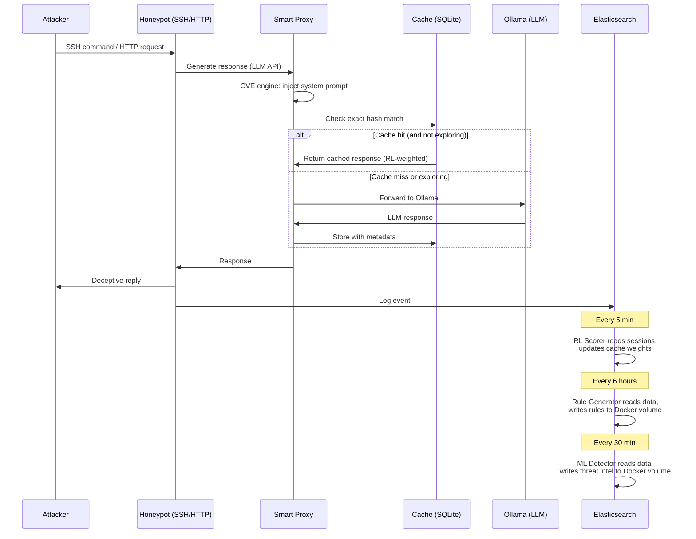

# Architecture

This document describes the system design, data flow, and component interaction
of the LLM Honeypot Intelligence platform.

---

## System overview

The platform extends a standard [T-Pot](https://github.com/telekom-security/tpotce)
honeypot deployment with a custom proxy layer that adds LLM-powered deception,
reinforcement learning, and automated detection engineering.

```
┌──────────────────────────────────────────────────────────────────┐
│  Internet (Attackers)                                            │
└──────────────┬───────────────────────────────────────────────────┘
               │
┌──────────────▼───────────────────────────────────────────────────┐
│  T-Pot VM                                                        │
│                                                                  │
│  ┌─────────┐ ┌─────────┐ ┌─────────┐ ┌─────────┐ ┌──────────┐  │
│  │Beelzebub│ │  Galah  │ │ Cowrie  │ │Dionaea  │ │Honeytrap │  │
│  │  (SSH)  │ │ (HTTP)  │ │  (SSH)  │ │(Malware)│ │ (Multi)  │  │
│  └────┬────┘ └────┬────┘ └────┬────┘ └────┬────┘ └────┬─────┘  │
│       │           │           │           │           │         │
│       ▼           ▼           ▼           ▼           ▼         │
│  ┌──────────────────────────────────────────────────────────┐   │
│  │                    Elasticsearch                         │   │
│  └──────────────────────────┬───────────────────────────────┘   │
│                             │                                    │
│  ┌──────────────────────────▼───────────────────────────────┐   │
│  │              Kibana · 7 Custom Dashboards                │   │
│  └──────────────────────────────────────────────────────────┘   │
└──────────────────────────────┬───────────────────────────────────┘
                               │ LLM requests (Beelzebub, Galah)
┌──────────────────────────────▼───────────────────────────────────┐
│  Host · Ollama Proxy Stack (Docker)                              │
│                                                                  │
│  ┌───────────────────────────────────────────────────────────┐   │
│  │  Smart Proxy (FastAPI, port 11435)                        │   │
│  │  ┌──────────┐  ┌─────────────┐  ┌──────────────────────┐ │   │
│  │  │CVE Engine│  │Semantic Cache│  │Exploration (ε=0.15) │ │   │
│  │  └──────────┘  └──────┬──────┘  └──────────────────────┘ │   │
│  └───────────────────────┼───────────────────────────────────┘   │
│                          │                                       │
│  ┌───────────┐  ┌────────▼───────┐  ┌────────────────────────┐  │
│  │RL Scorer  │  │ Ollama (LLM)   │  │ Rule Generator         │  │
│  │(5 min)    │  │ llama3 / ...   │  │ (6 hours)              │  │
│  └───────────┘  └────────────────┘  └────────────────────────┘  │
│                                                                  │
│  ┌────────────────────────┐  ┌───────────────────────────────┐  │
│  │ Heuristic Detector     │  │ C2 Detection Engine           │  │
│  │ (30 min)               │  │ (5 min)                       │  │
│  └────────────────────────┘  └───────────────────────────────┘  │
│                                                                  │
│  Output volumes:                                                 │
│    ollama-rules-output  → rules/                                 │
│    ollama-threat-output → threat-intel/                           │
└──────────────────────────────────────────────────────────────────┘
```

---

## Component detail

### Smart Proxy (`main.py`)

The proxy sits between the honeypot services and Ollama. For every incoming
LLM request:

1. **CVE enhancement:** If the request matches a known CVE profile, the CVE
   engine injects a vulnerability-specific system prompt (e.g., "You are an
   Apache Log4j 2.14.1 server. Respond to JNDI lookup attempts as if
   vulnerable.").
2. **Cache lookup:** Check exact match (hash), then semantic similarity
   (cosine distance via `nomic-embed-text` embeddings). Threshold: 0.85.
3. **Exploration:** With probability ε=0.15, bypass cache and generate a
   fresh response. This ensures the RL scorer has new data to evaluate.
4. **LLM generation:** Forward to Ollama, cache the response with metadata.

### RL Engagement Scorer (`rl_scorer.py`)

Every 5 minutes, the scorer:

1. Queries Elasticsearch for recent honeypot sessions
2. Calculates engagement metrics (session duration, command count, bytes
   exchanged, unique commands)
3. Correlates sessions with cached LLM responses via IP + timestamp
4. Updates cache entry weights using a reward function:
   `reward = α·duration + β·commands + γ·bytes + δ·unique_ratio`
5. Higher-scored responses are preferred on subsequent cache hits

### Rule Generator (`rule_generator.py`)

Every 6 hours, generates detection rules from attack data:

1. Query ES for recent attack events (configurable lookback window)
2. Extract patterns: IP ranges, ports, payloads, user agents, credentials
3. Generate Suricata rules (network signatures)
4. Generate Sigma rules (log-based detection, SIEM-agnostic)
5. Generate YARA rules (payload/file signatures)
6. Generate firewall blocklists (iptables, nftables, plain text)
7. Generate STIX 2.1 bundles with MITRE ATT&CK mapping
8. Generate IOC lists (JSON format)

### Heuristic Detector (`heuristic_detector.py`)

Every 30 minutes:

1. Feature extraction from ES data (session metrics, temporal patterns,
   payload characteristics)
2. Isolation Forest for anomaly scoring
3. DBSCAN clustering for campaign identification
4. IP reputation scoring based on behavioral patterns
5. Output: `ip_reputation.json`, `campaigns.json`, `alerts.json`,
   `dynamic_blocklist.txt`

### C2 Detection Engine (`c2_detection/engine.py`)

Every 5 minutes, analyzes active sessions for C2 indicators:

- **DNS tunneling:** High-entropy subdomain queries, abnormal query volume
  per source IP, TXT record abuse
- **HTTP beaconing:** Regular interval detection (jitter-aware), consistent
  payload sizes, known C2 framework patterns
- **Protocol anomalies:** Unexpected protocol on standard ports, encoding
  in headers, unusual HTTP methods

---

## Data flow



---

## Docker volume architecture

The proxy stack uses named Docker volumes to share data between containers
and with the host sync script:

| Volume | Writer | Reader | Content |
|--------|--------|--------|---------|
| `ollama-proxy-data` | Proxy, RL Scorer | All containers | SQLite cache DB |
| `ollama-rules-output` | Rule Generator | Sync script | Generated rules |
| `ollama-threat-output` | Heuristic Detector | Sync script | Threat intel outputs |

The sync script (`scripts/sync-to-github.sh`) runs on the host via cron,
reads from the Docker volumes using a temporary Alpine container, sanitizes
internal IP references, and pushes to GitHub.

---

## Security model

### What is public

- All custom Python source code
- Generated detection rules (Suricata, Sigma, YARA)
- Threat intelligence (IP reputation, campaigns, blocklists)
- STIX 2.1 bundles and IOC feeds
- Kibana dashboard definitions

### What is excluded

- Elasticsearch credentials and API keys
- TLS certificates and private keys
- Internal network IP addresses (sanitized to `[REDACTED]`)
- Raw Elasticsearch indices and log data
- Customer-specific honeypot configurations
- The upstream T-Pot codebase (linked, not copied)
